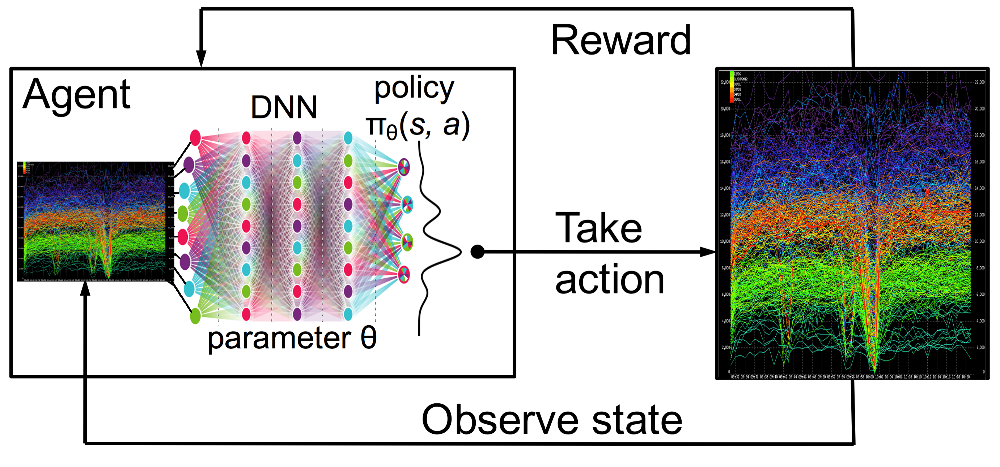

.. quant-trading-project-structure documentation master file.
   You can adapt this file completely to your liking, but it should at least
   contain the root `toctree` directive.

.. include:: intro.rst

Welcome to Quant Trading Project Structure!
===============================================

Below we expose a simple project structure for quantitative traders who want to develop new strategies or make research and development works. It is based in the the following works and we use either of them, depending on the works aim:

`cookiecutter-data-science`_

`cookiecutter-deeplearning`_

`luigi_data_science_project_cookiecutter`_

Why use this simple project structure?
======================================

When we think about quantitative trading research, we often think just about the resulting strategies, reports, or graph visualizations. While these final products are generally the main objects, it's easy to focus on making the products look nice and convincing to third party, even for ourself and forgetting the quality of the code that generates them.  Trading research science code quality is about correctness, standardization and reproducibility.

It is not a secret that good analysis is often the result of very scattered and random explorations. Tentative experiments and rapid testing approaches that may not work are part of the process to get good trading strategies.

Having said that, once it is started, it is not a process that lends itself to thinking carefully about the structure of your code or project design, so it is best to start with a logical and clean structure and stick to it at all times.

If you ever tried to reproduce an analysis you or your team did a few months ago or even a few years ago you know what I mean.  You may have written the code, but now it is impossible to decrypt whether you should use first_test.py, first_test_01.py or new_first_test.py to get things done.

.. toctree::
   :maxdepth: 3

   reproducibility

Getting started
===============

We've created a data science like bash script for linux to start the template for projects in Python. This script contains the three above template types. Your analysis doesn't have to be in Python, but the templates do provide some Python boilerplates.

.. toctree::
   :maxdepth: 3

   getting.rst

References
==========

.. toctree::
   
   references.rst

  
Indices and tables
==================

* :ref:`genindex`
* :ref:`modindex`
* :ref:`search`

.. _`quant-trading-project-structure`: https://github.com/parrondo/quant-trading-project-structure
.. _`cookiecutter-data-science`: https://github.com/drivendata/cookiecutter-data-science
.. _`cookiecutter-deeplearning`: https://github.com/tdeboissiere/cookiecutter-deeplearning
.. _`luigi_data_science_project_cookiecutter`: https://github.com/ffmmjj/luigi_data_science_project_cookiecutter
